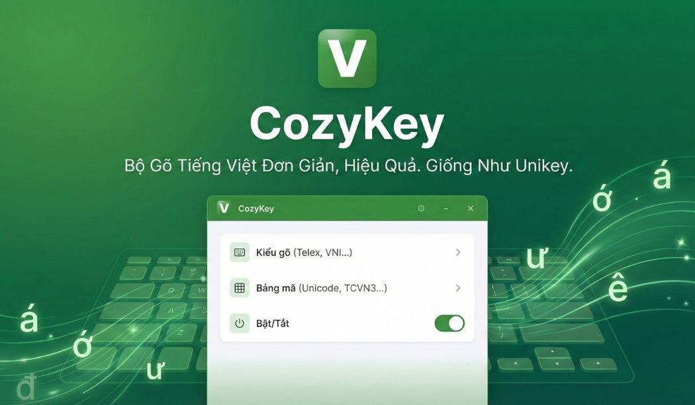

# CozyKey

> **Bộ gõ tiếng Việt hiện đại cho Windows**  
> Gõ mượt – tập trung sâu – nhắc thư giãn thông minh – tương thích tốt với app thực tế.

---

## 🚀 Tải bản mới nhất

- **Installer mới nhất (khuyến nghị):** [⬇️ CozyKey_Setup_v1.6.4.exe](./CozyKey_Setup_v1.6.4.exe)
- **Dung lượng:** ~49 MB
- **SHA256:** `3ffe456c49a903b468fae180680bf449413645baefd9d5529a5d994100e692e0`
- **Lưu ý phát hành:** Repo này chỉ giữ installer mới nhất; bản cũ xem ở tab Releases.

---

## Vì sao CozyKey khác biệt?

CozyKey không chỉ là bộ gõ tiếng Việt.  
Đây là công cụ “2 trong 1”: **gõ nhanh chính xác** + **giữ hiệu suất làm việc bền vững**.

- Bộ gõ mạnh, nhiều mode, tối ưu mixed-language.
- Có lớp tương thích ứng dụng để xử lý các app khó.
- Tích hợp hệ sinh thái **Deep Work + Thư giãn** rất thực tế, có cá tính riêng.
- Menu gọn, dùng nhanh, thông báo có nút **X** để tự đóng ngay.

---

## ✨ Tính năng nổi bật

### 1) Bộ gõ tiếng Việt linh hoạt, chống gõ sai thông minh
- Hỗ trợ:
  - **Telex**
  - **Simple Telex**
  - **Simple Telex 2**
  - **Telex + VNI**
  - **VNI** (cả numpad)
- **Z-undo + Adaptive tuning** luôn bật mặc định để giảm bẻ sai trong thực tế.
- Hỗ trợ tốt môi trường gõ trộn Việt + Anh + code.

### 2) Tương thích ứng dụng nâng cao (điểm ăn tiền)
- **Cho phép f/j/w/z làm phụ âm** (khi cần).
- **Clipboard Compatibility Mode (Ctrl+V)** cho app không nhận Unicode input chuẩn.
- **Blacklist theo ứng dụng**: tự tắt bộ gõ ở app foreground để tránh xung đột.

### 3) Tiện ích văn bản tích hợp
- Chuyển **có dấu → không dấu** ngay trong app.
- Tùy chọn thay khoảng trắng và đổi kiểu chữ (**thường / HOA / Viết Hoa Ký Tự Đầu Mỗi Chữ**).
- Có thể chọn **giữ dấu** hoặc **bỏ dấu** trước khi đổi kiểu chữ.
- Hỗ trợ **xóa dấu câu tự động** (bao gồm dấu phẩy và ký tự `|`).
- Có ô **whitelist ký tự giữ lại** khi xóa dấu câu (ví dụ `._-|` cho tên file/version).
- Có **preset nhanh**: Slug URL, Tiêu đề đẹp, Tên file an toàn, Bỏ dấu giữ khoảng trắng.
- Có nút **Dán từ Clipboard** và tùy chọn **Tự copy kết quả**.

### 4) Dictation (gõ bằng giọng nói)
- Gọi nhanh bằng `Alt+X`.
- Tự dừng khi im lặng, chèn trực tiếp vào vị trí con trỏ.

### 5) YouTube Mini Audio Player (mới)
- Dán link YouTube và phát trực tiếp ngay trong CozyKey.
- Mini mode để nghe là chính, chuyển nhanh giữa mini/large/fullscreen.
- Điều khiển tua tới/lùi, tăng/giảm tốc độ bằng hotkey toàn cục.
- Hotkey `Alt + B` mở nhanh cửa sổ tìm kiếm/chọn video và tự focus vào ô nhập.
- Khi video đang phát, menu chuột phải hiển thị ngay dòng trạng thái “▶ đang phát...”, bấm vào để mở player.
- Nút **Phát trong CozyKey** tự đóng cửa sổ tìm kiếm, chỉ giữ cửa sổ player để tránh rối màn hình.
- Tự tối ưu fallback khi gặp lỗi playback/nhúng (153, Playback ID...).

---

## 🧘 Deep Work & Thư giãn – phần được yêu thích nhất

CozyKey có “khung tập trung” riêng ngay menu chính:
- `🔥 Bắt đầu Deep Work...`
- `⏹️ Dừng Deep Work`
- `🍃 Nhắc thư giãn mỗi 15 phút`

### Deep Work: tập trung sâu nhưng không căng cứng
- Chạy phiên làm việc theo task.
- Có nhắc nhẹ khi còn nửa chặng, còn 5 phút, và nhắc theo nhịp.
- Kết thúc phiên có lời nhắc break để tránh “cháy não”.

### Mindfulness: nhắc thư giãn thật sự hữu ích
- Mỗi 15 phút nhắc bạn thở, giãn cơ, uống nước, nghỉ mắt.
- Tránh rơi vào trạng thái ngồi lì và quá tải thần kinh.

---

## 🌿 Ví dụ câu nhắc nhở trong CozyKey (trích từ app)

### Mindfulness dịu nhẹ
- “Hít vào sâu. Thở ra chậm. Mỉm cười nhẹ.”
- “Chỉ cần một nhịp thở, mình quay về hiện tại.”
- “Thả lỏng vai... và thở.”
- “Uống một ngụm nước, rồi quay lại nhé.”
- “Nhìn xa 20 giây để mắt được nghỉ.”

### Deep Work nhắc đúng thời điểm
- “Còn {x} phút. Hít thở sâu, tiếp tục nhé.”
- “Đã qua nửa chặng đường! Còn {x} phút. Uống ngụm nước rồi tiếp nhé.”
- “Còn 5 phút! Bạn sắp hoàn thành rồi.”

### Break reminder có chất riêng, vui và nhớ lâu
- “Não cậu đang bốc khói kìa! Nghỉ chút đi bro!”
- “Vibe check! Đôi mắt cậu đỏ hoe rồi kìa! Nghỉ ngơi là tự thương bản thân đó!”
- “Còn chờ gì nữa? Inbox người yêu 1 tin nhắn rồi hẵng quay lại làm việc!”

> Mục tiêu: nhắc đúng lúc, dễ thương, không khô khan như timer truyền thống.

---

## ⚡ Phím tắt nhanh

> CozyKey cho phép tùy chỉnh các phím tắt toàn cục trong:
> `⚙️ Hành vi & phím tắt` → `Thiết lập phím tắt...`
>
> Bảng dưới là cấu hình mặc định:

| Phím tắt | Chức năng |
|----------|-----------|
| `Alt + Z` | Bật/tắt bộ gõ tiếng Việt |
| `Ctrl + Shift` | Bật/tắt bộ gõ kiểu EVKey (không cần thêm phím chữ) |
| `Alt + A` | Đổi vòng âm thanh gõ |
| `Alt + Q` | Bắt đầu/Dừng Deep Work |
| `Alt + W` | Bật/tắt nhắc thư giãn |
| `Alt + X` | Bật/tắt Dictation (gõ bằng giọng nói) |
| `Alt + V` | YouTube: phát link từ clipboard |
| `Alt + Y` | YouTube: mở/hiện cửa sổ player |
| `Alt + B` | YouTube: mở cửa sổ tìm kiếm/chọn video |
| `Alt + M` | YouTube: chuyển Mini/Large |
| `Alt + K` | YouTube: Play/Pause |
| `Alt + J` | YouTube: tua lùi 10 giây |
| `Alt + L` | YouTube: tua tới 10 giây |
| `Alt + U` | YouTube: giảm tốc độ |
| `Alt + I` | YouTube: tăng tốc độ |
| `Ctrl + Shift + Wheel` | Tăng/giảm âm lượng (khi bật) |
| `Esc` | Hủy dictation khi đang ghi/đang xử lý |

---

## 🧩 Khi nào nên bật “Tương thích ứng dụng”?

Nếu gõ bị lỗi trong một app cụ thể:
1. Vào `🧩 Tương thích ứng dụng`
2. Bật `Chế độ tương thích Clipboard (Ctrl+V)`
3. Nếu vẫn lỗi, thêm app vào `Blacklist`

Ví dụ process name hay dùng:
- `code`
- `devenv`
- `idea64`
- `mstsc`

---

## Cài đặt nhanh

1. Tải **CozyKey_Setup_v1.6.4.exe**
2. Chạy installer (khuyên chạy quyền Administrator)
3. Cài đặt theo wizard
4. Mở CozyKey và kiểm tra icon ở system tray

---

## Yêu cầu hệ thống

- Windows 10 / 11 (64-bit)
- Quyền cài ứng dụng desktop
- Internet (nếu dùng Dictation API)

---

## Tác giả

**TranQuoc** – tduyquoc@gmail.com  
Tri ân Thầy: **Nguyễn Tiến Dũng**

---

## Lịch sử phiên bản

### v1.6.4 (2026) – Sửa Start with Windows + nâng cấp YouTube và tiện ích văn bản
- Commit source cho bản phát hành này: `9b46e1c`.
- Khắc phục lỗi người dùng phản ánh: bật “Khởi động cùng Windows” nhưng restart máy thì CozyKey không tự chạy.
- Nguyên nhân gốc:
  - CozyKey dùng `requestedExecutionLevel=requireAdministrator`.
  - Cơ chế startup cũ (startup folder / `HKCU\Run`) không ổn định cho app bắt buộc quyền Admin.
- Giải pháp áp dụng:
  - Chuyển sang **Scheduled Task (RunLevel Highest)** để tự chạy khi đăng nhập mà không vướng UAC popup mỗi lần.
  - Bật/tắt startup trong app giờ đồng bộ theo Scheduled Task và dọn cấu hình cũ `HKCU\Run`.
  - Installer cập nhật cùng cơ chế startup mới, không còn dựa vào startup shortcut/Run key truyền thống.
- Hotfix bổ sung cho spell-safe fallback:
  - Sửa trường hợp kiểu `gooogle/google` có thể bị bật lại conversion sai ở ký tự cuối.
  - Thêm regression tests để chặn các mẫu lỗi tương tự.
- Cập nhật UX YouTube theo phản hồi người dùng:
  - Dòng trạng thái “đang phát” hiển thị ngay ngoài menu chính, nằm dưới mục `🎬 YouTube (nghe/xem)`.
  - Trạng thái có hiệu ứng chữ chạy, bấm vào là mở cửa sổ player đang phát.
  - `Alt+B` mở cửa sổ tìm kiếm và tự đặt con trỏ vào ô tìm kiếm.
  - Bấm **Phát trong CozyKey** sẽ tự đóng cửa sổ tìm kiếm để chỉ giữ player.
- Nâng cấp tiện ích **Chuyển đổi văn bản** theo phản hồi sử dụng thực tế:
  - Đưa lên **menu cấp một**: bấm `📝 Chuyển đổi văn bản...` là mở ngay.
  - Thêm chế độ **xóa dấu câu tự động** (bao gồm dấu phẩy và ký tự `|`).
  - Thêm ô **whitelist** để giữ lại ký tự đặc biệt cần thiết (`._-|`...).
  - Thêm nhiều ký tự nối khi thay khoảng trắng (`-`, `_`, `.`, `+`, `/`).
  - Thêm preset nhanh + dán clipboard + tự copy kết quả để thao tác nhanh hơn.
- Hotfix sâu cho spell-safe fallback theo phản hồi gõ mixed-language:
  - Sửa lỗi sai vị trí dấu với cụm `ia`: `nghia` → `nghĩa`, đồng bộ cả Telex và VNI.
  - Sửa kiểu gõ từ tiếng Anh để không bị bẻ dấu sai: `gene`, `generator`, `calculator`, `blur` giữ nguyên literal.
  - Siết nhận diện âm tiết tiếng Việt: kiểm tra cụm phụ âm đầu hợp lệ và chặn mẫu không hợp chính tả (`ge/gê` thiếu `h`, `bl...`).
- Hotfix icon system tray theo phản hồi Dark mode:
  - Loại bỏ hoàn toàn nền tròn phía sau icon để không còn vòng trắng trên taskbar Dark mode.
  - Icon giờ chỉ còn chữ trắng viền đen (`V/E`) và lá xanh trên nền trong suốt.
- Chất lượng phát hành:
  - Build Release + test pass `177/177`.
  - Installer v1.6.4 đã đóng gói lại với SHA256 mới `3ffe456c49a903b468fae180680bf449413645baefd9d5529a5d994100e692e0`.

### v1.6.3 (2026) – Hotfix lỗi hiếm khi từ tiếng Việt bị trả về literal
- Commit source cho bản phát hành này: `bb2de74`.
- Sửa lỗi hiếm, khó tái hiện nhưng gây khó chịu khi gõ văn bản dài:
  - Ví dụ đang gõ `nên`, bấm space có lúc bị bật thành `neen`.
  - Sau khi xóa và gõ lại thì từ hoạt động bình thường.
- Nguyên nhân chính: trạng thái `prefer literal` có thể bị giữ quá lâu sau nhánh double-key undo (`aa/ee/oo`) ở token ngắn.
- Giải pháp:
  - Tinh chỉnh heuristic trong `KeyboardProcessor` để không khóa literal quá cứng cho chuỗi ngắn.
  - Cho phép quay lại nhánh convert sớm hơn ở các âm tiết tiếng Việt ngắn.
- Chất lượng phát hành:
  - Build Release và test pass `166/166`.
  - Đã đóng gói installer mới + cập nhật SHA256 đầy đủ.

### v1.6.2 (2026) – Đổi sang trình duyệt YouTube tích hợp, không cần API key
- Commit source cho bản phát hành này: `f072454`.
- Phản hồi từ người dùng được áp dụng trực tiếp:
  - Bỏ mô hình tìm kiếm qua YouTube Data API.
  - Không cần nhập API key, không còn bước cấu hình gây phiền.
- YouTube trong CozyKey giờ hoạt động theo kiểu trình duyệt mini:
  - Mở giao diện YouTube web đầy đủ để tự tìm kiếm/chọn video.
  - Có thanh nhập nhanh (từ khóa hoặc link), nút back/forward/reload/home.
  - Có nút **Phát trong CozyKey** để chuyển video đang mở về player của app.
- Giữ các cải tiến parser YouTube + test hồi quy từ v1.6.1 (`166/166` pass).
- Chuỗi commit kỹ thuật chính:
  - `f072454` – Đổi YouTube sang trình duyệt tích hợp, bỏ API key và phát hành v1.6.2

### v1.6.1 (2026) – Nâng cấp YouTube: tìm kiếm + duyệt danh sách video
- Commit source cho bản phát hành này: `cdc111d`.
- Bản chuyển tiếp để thử nghiệm mô hình YouTube catalog theo API và ghi nhận phản hồi sử dụng thực tế.

### v1.6.0 (2026) – Mốc nâng cấp lớn: hoàn thiện gõ tự do kiểu EVKey
- Commit source cho bản phát hành này: `e34435c`.
- Nâng mốc phiên bản chính từ nhánh 1.5.x lên **1.6.0** để đánh dấu giai đoạn ổn định mới của bộ gõ.
- Hoàn thiện nhóm cải tiến gõ tự do:
  - `lene` → `lên`
  - `nene` / `nenes` → `nên` / `nến`
  - `duocdwj` → `được`
  - `ducd` / `ducds` → `đuc` / `đúc`
- Duy trì an toàn mixed-language và tương thích mode:
  - Không làm bật lại quy tắc `uow` trong **Simple Telex / Simple Telex 2**.
  - Giữ đúng hành vi undo và fallback đã ổn định từ các bản trước.
- Chất lượng phát hành:
  - Build Release + test pass toàn bộ `156/156`.
  - Installer mới đã đóng gói lại và cập nhật SHA256 đầy đủ.
- Chuỗi commit kỹ thuật liên quan đến mốc v1.6.0:
  - `ded66e6` – Nâng cấp gõ dấu tự do kiểu EVKey (`nenes -> nến`)
  - `664247a` – Mở rộng `lene`, `duocdwj` và phát hành v1.5.31
  - `d8a8878` – Mở rộng gõ chữ `đ` tự do (`ducd`, `ducds`) và phát hành v1.5.32
  - `e34435c` – Nâng mốc phiên bản lớn lên v1.6.0, đồng bộ ghi chú phát hành đầy đủ

### v1.5.32 (2026) – Mở rộng gõ chữ đ tự do
- Commit source cho bản phát hành này: `d8a8878`.
- Nâng cấp thêm kiểu gõ chữ `đ` theo phong cách tự do:
  - `ducd` → `đuc`
  - `ducds` → `đúc`
- Vẫn giữ các cải tiến gõ dấu tự do EVKey ở bản trước (`lene`, `nene(s)`, `duocdwj`).
- Commit liên quan kể từ mốc v1.5.31:
  - `d8a8878` – Mở rộng gõ chữ đ tự do và phát hành installer v1.5.32

### v1.5.31 (2026) – Nâng cấp gõ dấu tự do kiểu EVKey
- Commit source cho bản phát hành này: `664247a`.
- Tăng khả năng gõ dấu tự do:
  - `lene` → `lên`
  - `nene` / `nenes` → `nên` / `nến`
  - `duocdwj` → `được`
- Giữ tương thích các mode Simple Telex (không làm bật lại quy tắc `uow` khi mode đã tắt).
- Commit liên quan kể từ mốc v1.5.30:
  - `ded66e6` – Nâng cấp gõ dấu tự do kiểu EVKey (`nenes -> nến`)
  - `664247a` – Mở rộng thêm `lene`, `duocdwj` và phát hành installer v1.5.31

### v1.5.30 (2026) – YouTube + hotkey + spell-safe được hoàn thiện sâu
- Commit source cho bản phát hành này: `16f4572`.
- Các thay đổi lớn từ sau mốc `v1.5.0`:
  - Tích hợp YouTube Player + Mini Audio mode.
  - Ổn định WebView2 runtime và xử lý nhiều lỗi playback/embed.
  - Hoàn thiện fullscreen/miniplayer UI, pin, auto-hide, transparent controls.
  - Tối ưu hotkey theo hướng tiện tay, giảm xung đột, hỗ trợ kiểu EVKey.
  - Chặn mở trùng cửa sổ tiện ích (settings/towiac/blacklist).
  - Sửa triệt để nhóm lỗi gõ mixed-language như `keep -> kêp`, `dowww/dowwnlo`.
- Danh sách commit đầy đủ từ `11b664b` đến `16f4572`:
  - `f30c4c5` – Tích hợp YouTube Player với tua/chỉnh tốc độ bằng phím tắt và cập nhật installer
  - `31c1925` – Sửa triệt để lỗi YouTube không khởi tạo WebView2 và nâng installer lên v1.5.1
  - `dff1243` – Sửa lỗi YouTube 153 bằng định danh Referer và phát hành installer v1.5.2
  - `b77d7c0` – Khắc phục lỗi YouTube Playback ID bằng fallback watch page và phát hành v1.5.3
  - `60abf0a` – Sửa lỗi phát link YouTube watch và giữ mốc thời gian t, phát hành installer v1.5.4
  - `48d017e` – Thêm Mini Audio mode cho YouTube, ẩn tối đa cửa sổ và phát hành installer v1.5.5
  - `96517cc` – Tối ưu UX YouTube Mini Audio và thêm phím tắt mở nhanh/phát từ clipboard, phát hành v1.5.6
  - `0a9a7b0` – Sửa tự phát YouTube, mặc định auto-hide có nút ghim và tối giản mini mode, phát hành v1.5.7
  - `f5157a3` – Tăng khả năng tự phát YouTube và sửa bỏ ghim chỉ ẩn cửa sổ không dừng nhạc, phát hành v1.5.8
  - `0aadebb` – Bỏ cảnh báo autoplay, giữ mini mode có ghim và sửa khối đen che giao diện, phát hành v1.5.9
  - `31929d8` – Sửa chế độ toàn màn hình YouTube hoạt động ổn định và phát hành installer v1.5.10
  - `3a09ffa` – Sửa thoát toàn màn hình, ẩn lỗi ConnectionAborted giả và đồng bộ trạng thái âm lượng YouTube, phát hành v1.5.11
  - `0664767` – Sửa nút toàn màn hình trong player và tối giản mini mode với ghim/fullscreen, phát hành v1.5.12
  - `0ec95b2` – Sửa icon fullscreen đồng bộ, làm rõ nút mini mode và chỉ giữ installer v1.5.0 cùng v1.5.13
  - `585e539` – Đồng bộ icon fullscreen theo trạng thái và tinh chỉnh nút mini mode tinh tế, phát hành v1.5.14
  - `3a6a02f` – Sửa icon fullscreen đổi đúng trạng thái và làm nút mini mode mờ tinh tế, phát hành v1.5.15
  - `52c0198` – Sửa dứt điểm icon fullscreen đổi tức thì và thiết kế nút mini mode mờ bo góc tinh tế, phát hành v1.5.16
  - `9ac01e6` – Sửa dứt điểm lỗi phải bấm 2 lần để thoát fullscreen và làm nút mini player nền trong suốt, phát hành v1.5.17
  - `a0a7d67` – Sửa triệt để nút toàn màn hình một chạm và bỏ nền nút mini player, phát hành v1.5.18
  - `c639f78` – Tinh chỉnh nút mini player trong suốt mờ tinh tế hơn và ổn định fullscreen một chạm, phát hành v1.5.19
  - `ea8fe2f` – Sửa dứt điểm lỗi fullscreen YouTube phải bấm 2 lần và tinh chỉnh nút mini player trong suốt tinh tế, phát hành v1.5.20
  - `f651590` – Sửa đúng lỗi fullscreen từ nút custom phải bấm 2 lần và tinh chỉnh nút mini trong suốt viền mảnh hơn, phát hành v1.5.21
  - `d3dc992` – Sửa đúng lỗi fullscreen nút YouTube khi vào bằng nút custom và bỏ thông báo chuyển mini/large, phát hành v1.5.22
  - `98d7527` – Sửa dứt điểm lỗi nút YouTube fullscreen khi vào bằng nút custom và tinh chỉnh nút mini tinh tế hơn, phát hành v1.5.23
  - `c4ed24b` – Tối ưu phím tắt YouTube tiện tay hơn và cải thiện thông báo xung đột hotkey, phát hành v1.5.24
  - `fa63114` – Chuyển hotkey core sang Ctrl+Alt, tự migrate bộ cũ và phát hành installer v1.5.25
  - `8e10dcf` – Khôi phục phím chuyển kiểu EVKey, tránh tê liệt toàn bộ hotkey khi xung đột và phát hành v1.5.26
  - `a0e9b74` – Đổi mặc định hotkey Alt+phím, sửa xung đột hotkey và chặn mở trùng cửa sổ tiện ích, phát hành v1.5.27
  - `6b9b764` – Sửa triệt để lỗi keep thành kêp và mở rộng spell-safe fallback cho các mẫu tương tự, phát hành v1.5.28
  - `c457e4f` – Sửa triệt để lỗi lặp phím w sau undo (dow -> doww) và phát hành installer v1.5.29
  - `16f4572` – Sửa triệt để lỗi dowww/dowwnlo sau undo phím w và phát hành installer v1.5.30

### v1.5.0 (2026) – bản nâng cấp lớn
- Build ổn định hiện tại được đóng gói từ source commit: `11b664b`.
- Ghi chú commit đầy đủ của đợt ổn định này:
  - `11b664b` – Reapply "Sửa triệt để lỗi đơ bàn phím do toast Deep Work cướp focus và cập nhật installer"
  - `8821b13` – Revert "Sửa dứt điểm đơ bàn phím lần đầu sau Ctrl+Shift+M và cập nhật installer"
  - `5c6edc4` – Hoàn tất revert b286470 và đồng bộ installer theo mã hiện tại
  - `481556c` – Revert "Sửa triệt để lỗi đơ bàn phím do toast Deep Work cướp focus và cập nhật installer"
  - `3acf459` – Sửa dứt điểm đơ bàn phím lần đầu sau Ctrl+Shift+M và cập nhật installer
  - `b286470` – Sửa triệt để lỗi đơ bàn phím do toast Deep Work cướp focus và cập nhật installer
  - `789ab62` – Sửa gốc lỗi toast cướp focus bằng hiển thị no-activate và cập nhật installer
  - `b7064c2` – Sửa triệt để thông báo không cướp focus khi đang gõ và cập nhật installer mới
- Hoàn tất lộ trình nâng cấp bộ gõ 10 bước.
- Thêm nhiều mode gõ mới: Simple Telex, Simple Telex 2, Telex+VNI.
- Tăng mạnh tương thích ứng dụng: Clipboard mode, Blacklist app, tối ưu mixed-language.
- Auto viết hoa sau `. ! ? Enter`.
- Tích hợp tiện ích chuyển có dấu → không dấu.
- Tối ưu menu và trải nghiệm thông báo (nút **X** đóng nhanh).
- Hotfix triệt để lỗi gõ `oo/aa/dd` bị adaptive chặn sai (gõ `oo` ra `ô` đúng ngay).
- Thêm màn hình **Thiết lập phím tắt**: đổi hotkey cho Toggle/Âm thanh/Deep Work/Mindfulness/Dictation.
- Sửa lỗi hiển thị header trong màn hình thiết lập phím tắt (không còn mất chữ).
- Hotfix nhiều vòng cho **Clipboard Compatibility** để gõ ổn định hơn trên Word/Excel/browser.
- Sửa lỗi loạn ký tự có dấu đầu tiên khi đổi ngữ cảnh nhập (click đổi ô, dùng Ctrl/Alt shortcut rồi gõ tiếp).
- Chặn gán các phím tắt hệ thống/browser phổ biến (ví dụ `Ctrl+Shift+T`, `Ctrl+L`, `Ctrl+T`) để tránh CozyKey chiếm dụng.
- Sửa triệt để thông báo Deep Work/Thư giãn không còn cướp focus con trỏ khi đang gõ.
- Hotfix bổ sung: xử lý sâu đường hiển thị toast `no-activate` để tránh tình trạng bàn phím bị đơ sau khi nhắc Deep Work.
- Hotfix dứt điểm: tự phục hồi focus khỏi toast/helper ngay khi phát hiện, xử lý tình trạng đơ bàn phím ở lần bật nhắc Deep Work đầu tiên.
